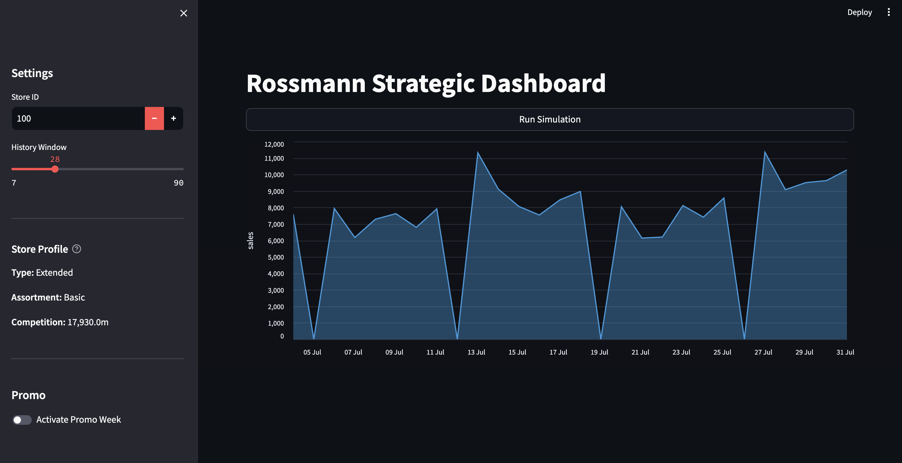
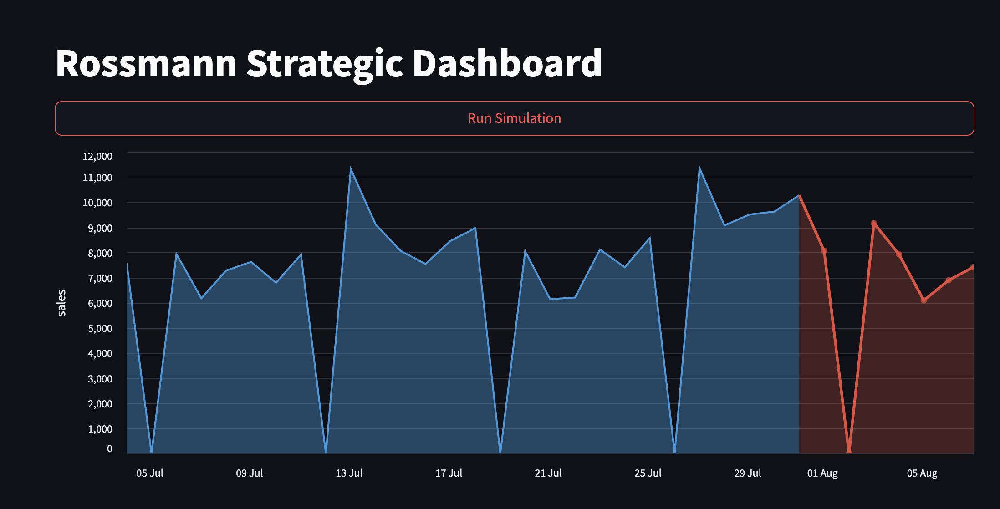
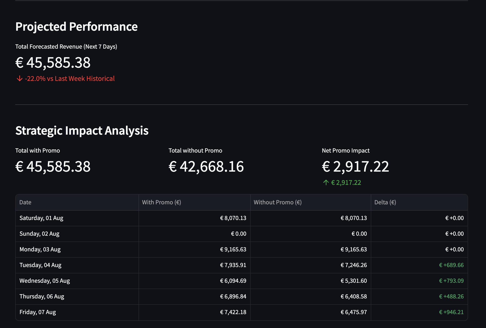

# Rossmann Strategic Dashboard
## Scalable Sales Forecasting & Strategy Simulator

> **Quick Start:** Skip to [Installation & Setup](#installation).

**Rossmann Strategic Dashboard** is a sales forecasting tool that transforms over **1.1 million historical records** into actionable business intelligence. By processing data from a massive network of **1,115 stores across Germany**, the system leverages a **Recursive LSTM** neural network to provide precise sales forecasts, achieving a solid **8.63% MAPE** on unseen data and simulate strategic scenarios in real-time.

Designed as a functional **Strategy Simulator**, this dashboard bridges the gap between historical time-series data and daily operational decisions. It allows users to visualize the potential impact of promotions and seasonal shifts, providing a data-driven baseline before implementing changes in the physical store.

---

## The Power of Data at Scale
The core of this project is built to handle significant data complexity:

* **Efficient Learning**: The model was trained on a high-granularity dataset, capturing essential sales patterns, holiday effects, and regional dynamics.
* **Store-Specific Logic**: The system accounts for the unique identity of every store, considering its competitive landscape and assortment strategy.
* **Practical Business Value**: In retail, even small forecasting errors can lead to inventory issues. This tool helps mitigate uncertainty by modeling recurring seasonal patterns and periodic market fluctuations.
---

## Dashboard Overview
The interface is designed for immediate operational clarity, splitting global controls from interactive data visualization.



### 1. Sidebar: The Control Center 
The sidebar acts as the central hub for configuring the analysis context:

* **Selection & History**: Users can select a specific **Store ID** (out of 1,115) and define the **History Window** (from 7 to 90 days) to adjust the look-back period for the chart.
* **Store Profile (Dynamic Metadata)**: Performs a real-time database query to retrieve and display the selected store's specific characteristics—including **Store Type**, **Assortment level**, and **Competition Distance**—complemented by an integrated "Help" icon for instant business definitions of store archetypes.
* **Strategy Toggle**: A dedicated switch to activate the **Promo Week** scenario, preparing the model for a strategic simulation.

### 2. Main Interface: Interactive Analytics
The main panel focuses on visualizing sales trends through an interactive engine:

* **Interactive Altair Chart**: The primary visualization supports **zooming** and **panning**, allowing for both high-level trend analysis and granular inspection of specific date ranges.
* **Data Export & Tools**: Each chart and table comes with built-in utility features, allowing users to **download data as CSV** or save the visualization as a PNG/SVG for external reporting.
* **Simulation Trigger**: The "Run Simulation" button initiates the dual-path inference engine, merging historical data with real-time AI projections.

## Strategic Simulation: Promo ON
When the "Promo Week" is activated, the dashboard transforms into a strategic evaluation tool. The system calculates the incremental value by running two parallel AI inferences: a **Standard Baseline** (no promo) and a **Strategic Scenario** (promo active).




### 1. Visualizing the Future
The primary chart reflects the AI's prediction by adding a distinct **red area** to the timeline. This color-coded zone visually separates future projections from historical ground-truth data, allowing for an immediate understanding of the expected sales trajectory.

### 2. Projected Performance
This module provides a reality check by comparing the upcoming 7-day forecast against the store's most recent performance:
* **Total Forecasted Revenue**: Displays the aggregate sales expected for the next 7 days.
* **Week-over-Week (WoW) Trend**: Automatically calculates the percentage variance against the previous 7 days of history, using red or green indicators to signal whether the upcoming period is trending above or below recent performance.

### 3. Strategic Impact Analysis
This section shows how a promotion changes the forecast by comparing a **Standard Prediction** (no promo) against a **Promo Prediction**:

* **Scenario Totals**: Displays the total revenue for both cases side-by-side to show the difference.
* **Net Gain**: Calculates the total "extra" sales generated specifically by the promotion.
* **Daily Delta**: A table showing the day-by-day difference between the two forecasts, highlighting exactly when the strategy is most effective.
  
---

## Engineering & Design Choices

The project is architected to handle industrial-scale data by separating the data layer, the deep learning engine, and the user interface.

### 1. Hybrid AI Architecture
The forecasting engine uses a multi-input Deep Learning model designed to capture both time-series trends and static store attributes:
* **Recursive LSTM Branch**: Processes a 7-day sliding window of 11 features (Sales, Promos, Holidays, etc.) to learn temporal dependencies.
* **Entity Embeddings**: A specialized branch that maps 1,115 unique Store IDs into a continuous vector space, allowing the model to learn hidden similarities between different store locations.
* **Target Transformation**: Sales data is processed using a **Log Transformation** ($\log(1+x)$) to normalize variance and improve model stability.

### 2. Data Engineering & MLOps
The system is built for reproducibility and efficiency:
* **SQL-Side Preprocessing**: Critical features like the **7-day rolling average** are calculated directly within PostgreSQL using **Window Functions**, drastically reducing the memory footprint on the application side.
* **Inference Strategy**: The dashboard performs **Recursive Multi-Step Forecasting**, where each day's prediction is used as an input feature for the next day, ensuring continuity throughout the 7-day window.

### 3. Containerized Ecosystem
The entire solution is orchestrated via **Docker**, ensuring that the environment is consistent across development and production:
* **Database Container (`db`)**: A PostgreSQL instance that persists over 1.1 million records and provides high-speed data retrieval.
* **Application Container (`app`)**: A Python-based environment hosting the Streamlit dashboard and the TensorFlow inference engine.
* **Network Isolation**: Both containers communicate over a private bridge, keeping the database secure and inaccessible from outside the local network.

---

## Model Performance
The model was validated using a strict 3-way temporal split (Train/Val/Test) to ensure it generalizes well to future data.

| Metric | Result (Unseen Data) |
| :--- | :--- |
| **MAE** | € 607.58 |
| **MAPE** | **8.63%** |
| **RMSPE** | 0.1191 |

### Understanding the Metrics
* **MAE (Mean Absolute Error)**: Represents the average forecasting error in Euros per prediction.
* **MAPE (Mean Absolute Percentage Error)**: Shows the average error as a percentage of actual sales. At **8.63%**, it indicates a highly reliable baseline for retail operations.
* **RMSPE (Root Mean Square Percentage Error)**: A standard industry metric that penalizes larger forecasting gaps more heavily, ensuring the model remains robust against extreme outliers.

---

## Tech Stack

### Frontend & Visualization
* **Streamlit**: Used to build the interactive web dashboard and handle the application state.
* **Altair**: Powers the interactive charts, supporting zooming, panning, and customized tooltips.

### Machine Learning & Data Science
* **TensorFlow / Keras**: Used for architecting and training the Hybrid LSTM + Embedding model.
* **Scikit-Learn**: Utilized for data preprocessing, including scaling (MinMaxScaler) and categorical encoding.
* **Pandas & NumPy**: The core libraries for data manipulation and numerical operations.
* **Joblib**: Handles the persistence of the data scalers to ensure consistency between training and inference.

### Data & Infrastructure
* **PostgreSQL**: The primary relational database for storing and querying sales records.
* **SQLAlchemy**: Provides the connection bridge between the Python application and the database.
* **Docker & Docker Compose**: Used to containerize the entire ecosystem, ensuring a consistent environment for the DB and the App.

---
<a name="installation"></a>
## Installation & Setup

To run the entire ecosystem (PostgreSQL Database + Streamlit Dashboard) locally, ensure you have Docker installed.

### 1. Clone the Repository

```bash
git clone https://github.com/DenisMal00/rossmann-sales-engine.git
cd rossmann-sales-engine
```

### 2. Data and Model Preparation
* **Dataset**: Download `train.csv` and `store.csv` from the [Kaggle Rossmann Store Sales competition](https://www.kaggle.com/competitions/rossmann-store-sales/data).
* **Storage**: Create a `data/` folder in the project root and place the two CSV files inside it.
* **Pre-trained Models**: Ensure that the `sales_model.keras` and `scaler.joblib` files are present in the `models/` directory. These files allow you to skip the training phase and start generating forecasts immediately.

### 3. Start the Infrastructure
Build and launch the containerized environment (PostgreSQL + Python App):
```bash
docker-compose up -d --build
```

### 4. Database Ingestion
Populate the PostgreSQL database with the raw sales records:
```bash
docker-compose exec app python src/ingest_data.py
```

### 5. Access the Dashboard
Once the ingestion is finished, open your web browser and navigate to the local address:
**[http://localhost:8501/](http://localhost:8501/)**


